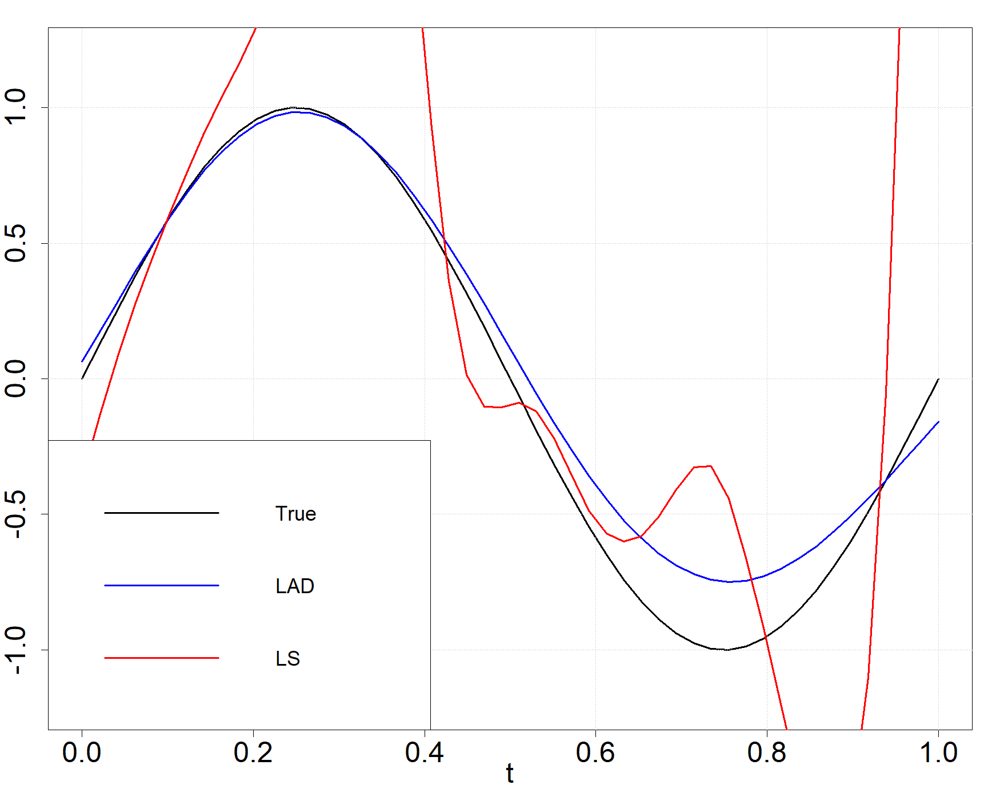

This repository contains fast C++ implementations with an R interface of the penalized spline estimators of Kalogridis (2025+) as well as a remake of the older smoothing spline estimator of
Kalogridis and Van Aelst (2023, SJS). 

Here are detailed instructions:
1. First, download all the files in your R working directory.
2. Open and load the R-functions quad_smsp.R (Quantile Smoothing Spline Estimator), quad_pensp.R (Quantile Penalized Spline Estimator) and ls_pensp2.R (Least-Squares Penalized Spline Estimator).
3. Be sure to have installed and loaded the R-packages fda, Rcpp and RcppArmadillo.
4. These R functions will source the combined.cpp file containing the C++ implementations; no C++ knowledge is required.

Here is an example of their use in R with simulated discretely sampled functional data:

```r
set.seed(2)
n    <- 100
p    <- 50

t_grid <- seq(0, 1, length.out = p)
Y <- matrix(NA, nrow = n, ncol = p)

## Population mean
mu_true <- function(t) sin(2 * pi * t) # Easy
# mu_true <- function(t) exp(-(t-0.25)^2/0.01)+exp(-(t-0.50)^2/0.01) + exp(-(t-0.75)^2/0.01) # Much harder

mu_grid <- mu_true(t_grid)

  X <- matrix(NA, nrow = n, ncol = p)
  for(i in 1:n){
    X[i,] <- mu_grid 
    for(j in 1:50){ 
      X[i,] <- X[i, ] +  sqrt(2)*rt(1, df = 5)*sapply(t_grid, FUN = function(x) sin((j-1/2)*pi*x)/((j-1/2)*pi) )
    }
    m_i <- sample(floor(0.5 * p):floor(0.8 * p), 1)
    idx <- sort(sample(seq_len(p), m_i))
    zeta <- 0.5*rt(m_i, df = 10)
    Y[i, idx] <- X[i, idx] + zeta
  }

  fit.lspensp <- ls_pensp(Y, K = 30)
  fit.pensp <- quan_pensp(Y, alpha = 0.5, K = 30) # penalized-spline quantile estimator
  
  par(mar = c(4,3.5,2,2), mgp = c(3, 1.5, 0))
  plot(t_grid, mu_grid, lwd = 3, lty = 1, type = "l", cex.axis = 2.5, cex.lab = 2.5, ylab = "", xlab = "t",
       ylim = c(-1.2, 1.2)) ; grid()
  lines(t_grid,fit.pensp$mu, lwd = 3, type= "l", col = "blue")
  lines(t_grid, fit.lspensp$mu, lwd = 3, type = "l", col = "red")
```
If the measurement errors follow a light-tailed distribution, the estimators perform comparably. 


But for heavier tailed measurement errors the situation changes drastically:

```r
 set.seed(2)
 X <- matrix(NA, nrow = n, ncol = p)
  for(i in 1:n){
    X[i,] <- mu_grid 
    for(j in 1:50){ 
      X[i,] <- X[i, ] +  sqrt(2)*rt(1, df = 5)*sapply(t_grid, FUN = function(x) sin((j-1/2)*pi*x)/((j-1/2)*pi) )
    }
    m_i <- sample(floor(0.5 * p):floor(0.8 * p), 1)
    idx <- sort(sample(seq_len(p), m_i))
    zeta <- 0.5*rt(m_i, df = 1)
    Y[i, idx] <- X[i, idx] + zeta
  }

  fit.lspensp <- ls_pensp(Y, K = 30)
  fit.pensp <- quan_pensp(Y, alpha = 0.5, K = 30) # penalized-spline quantile estimator
  
  par(mar = c(4,3.5,2,2), mgp = c(3, 1.5, 0))
  plot(t_grid, mu_grid, lwd = 3, lty = 1, type = "l", cex.axis = 2.5, cex.lab = 2.5, ylab = "", xlab = "t",
       ylim = c(-1.2, 1.2)) ; grid()
  lines(t_grid,fit.pensp$mu, lwd = 3, type= "l", col = "blue")
  lines(t_grid, fit.lspensp$mu, lwd = 3, type = "l", col = "red")
```

